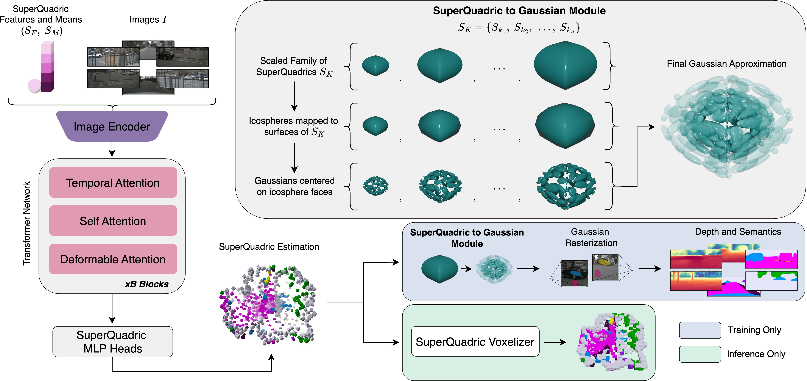

<h1 align="center">SuperQuadricOcc: Multi-Layer Gaussian Approximation of Superquadrics for Real-Time Self-Supervised Occupancy Estimation</h1>

<strong>Seamie Hayes</strong>1,2, 
<strong>Reenu Mohandas</strong>1, 
<strong>Tim Brophy</strong>1
<strong>Alexandre Boulch</strong>3
<strong>Ganesh Sistu</strong>1
<strong>Ciaran Eising</strong>1,2

1 D²iCE Research Centre, University of Limerick &nbsp;&nbsp; 2Taighde Éireann – Research Ireland &nbsp;&nbsp; 3Valeo.ai

<a href="https://arxiv.org/abs/2511.17361">[arXiv]</a>

## Abstract
Short 3–5 sentence summary. Keep it readable.

---
