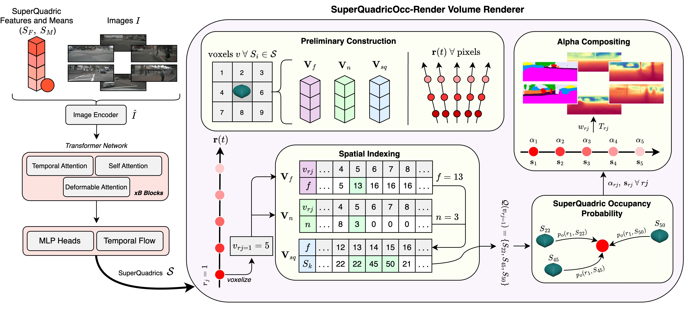

<div align="center">

<h1>SuperQuadricOcc: Real-Time Self-Supervised Semantic Occupancy Estimation with Superquadric Volume Rendering</h1>

<p>
  <a href="https://scholar.google.com/citations?user=3fffnjYAAAAJ&hl=en"><strong>Seamie Hayes</strong></a><sup>1,2</sup>,
  <a href="https://scholar.google.com/citations?user=iJ3qFGAAAAAJ&hl=en"><strong>Alexandre Boulch</strong></a><sup>3</sup>,
  <a href="https://scholar.google.com/citations?user=HTfERCsAAAAJ&hl=en"><strong>Andrei Bursuc</strong></a><sup>3</sup>,
  <a href="https://scholar.google.com/citations?user=Ku6jvh0AAAAJ&hl=en"><strong>Reenu Mohandas</strong></a><sup>1</sup>,<br>
   <a href="https://scholar.google.com/citations?user=356ahmwAAAAJ&hl=en"><strong>Ganesh Sistu</strong></a><sup>1</sup>,
  <a href="https://scholar.google.com/citations?user=dDgm87sAAAAJ&hl=en"><strong>Tim Brophy</strong></a><sup>1</sup>,
  <a href="https://scholar.google.com/citations?user=aH6w8VcAAAAJ&hl=en"><strong>Ciaran Eising</strong></a><sup>1,2</sup>
</p>

<p>
<sup>1</sup> D²iCE Research Centre, University of Limerick &nbsp;&nbsp; <sup>2</sup> Taighde Éireann – Research Ireland &nbsp;&nbsp; <sup>3</sup> Valeo.ai
</p>

[](https://seamie6.github.io/SuperQuadricOcc/)
[](https://arxiv.org/abs/2511.17361)

</div>



Video visualizations are provided in the ```assets/video``` folder. Details for training and evaluation setup are given below.

## Environmental Setup
Setup for CUDA 11.3 tested on NVIDIA A100. Also tested for CUDA 11.8 on NVIDIA H100 with different setup.

### 1. Conda environment
<details>
  <summary>Click to see more</summary>

```shell script
  conda create -n sqocc python=3.8 -y
  conda activate sqocc
```
</details>

### 1. Pip installs
<details>
  <summary>Click to see more</summary>

```shell script
  # install pytorch
  pip install torch==1.11.0+cu113 torchvision==0.12.0+cu113 torchaudio==0.11.0+cu113 -f https://download.pytorch.org/whl/torch_stable.html

  # install openmim, used for installing mmcv
  pip install -U openmim

  # install mmcv
  mim install mmcv-full==1.6.0 -f https://download.openmmlab.com/mmcv/dist/cu113/torch1.11.0/index.html

  # install mmdet and ninja
  pip install mmdet==2.25.1 ninja==1.11.1

  # install pytorch3D for renderer
  pip install --no-cache-dir pytorch3d -f https://dl.fbaipublicfiles.com/pytorch3d/packaging/wheels/py38_cu113_pyt1110/download.html

  # Install SuperQuadricOcc and SQOcc-Render (CUDA)
  pip install -v -e .

  # install GroundedSAM (for pseudo labels)
  python -m pip install -e groundedsam/segment_anything
  python -m pip install -e groundedsam/GroundingDINO
  pip install diffusers transformers accelerate scipy safetensors
```
</details>

## Data Setup
Our data setup follows that of [GaussianFlowOcc](https://github.com/boschresearch/GaussianFlowOcc) with the addition of ground truth depth label generation for evaluation purposes.

### Data Preparation

<details>
  <summary>Click to see more</summary>
1. Please create a directory `./data` and `./ckpts` in the root directory of the repository.

2. Download nuScenes [https://www.nuscenes.org/download].

3. Download the Occ3D-nuScenes dataset from [https://github.com/Tsinghua-MARS-Lab/Occ3D]. The download link can be found in their README.md.

4. Download the OpenOccv2 dataset from [https://github.com/OpenDriveLab/OccNet]. The occupancy labels are located in the file `openocc_v2.1.zip`.

5. Generate the annotation files.  This will put the annotation files into the `./data` directory by default. The process can take up to ~1h.
```shell script
python tools/create_data_bevdet.py
```
6. [Optional] Generate ground truth depth for depth evaluation
```shell script
python tools/export_gt_depth_nusc.py
```

7. Copy or softlink the files into the `./data` directory. The structure of the data directory should be as follows:

```shell script
superquadricocc
    ├──data
    │   ├── nuscenes
    │   │  ├── v1.0-trainval (Step 2, nuScenes+nuScenes-panoptic files)
    │   │  ├── sweeps (Step 2, nuScenes files)
    │   │  ├── samples (Step 2, nuScenes files)
    │   │  └── panoptic (Step 2, nuScenes-panoptic files)
    │   ├── gts (Step 3)
    │   ├── openocc (Step 4)
    │   ├── bevdetv2-nuscenes_infos_train.pkl (Step 5)
    │   ├── bevdetv2-nuscenes_infos_val.pkl (Step 5)
    │   ├── bevdetv2-nuscenes_infos_test.pkl (Step 5)
    │   ├── gt_depth (Step 6)
    │   ├── metric_3d_nusc (See next chapter)
    │   └── groundedsam (See next chapter)
    ├──ckpts
    └──...
```
</details>

### Generate Pseudo-Labels

<details>
  <summary>Click to see more</summary>

Please create two directories `metric_3d_nusc` and `groundedsam` in a location with enough disk space and softlink them into `./data`, as the following scripts will write data to these locations (the `./data` directory should look like in the tree above).
#### 1. Pseudo Depth
First, we generate the pseudo depth labels using [Metric3D](https://github.com/YvanYin/Metric3D) (~550 GB).
```shell script
python tools/generate_m3d_nusc.py
```

You can parallelize this by starting multiple runs and specify a scene range for each run.
Example:
```shell script
python tools/generate_m3d_nusc.py --scene-prefix scene-00 scene-01 scene-02
python tools/generate_m3d_nusc.py --scene-prefix scene-03 scene-04 scene-05
python tools/generate_m3d_nusc.py --scene-prefix scene-06 scene-07 scene-08
python tools/generate_m3d_nusc.py --scene-prefix scene-09 scene-10 scene-11
```

#### 2. Pseudo Semantics
Next, we generate the pseudo semantic labels using [GroundedSAM](https://github.com/IDEA-Research/Grounded-Segment-Anything) (~276 GB). 

Download the SAM checkpoint
```shell script
# Download SAM checkpoint into ./ckpts
cd ckpts
wget https://dl.fbaipublicfiles.com/segment_anything/sam_vit_h_4b8939.pth 
cd ..
```

Run the generation script:
```shell script
# single GPU
python3 groundedsam/generate_grounded_sam.py --single-gpu
# multi GPU with 4 GPU's
python -m torch.distributed.launch --nproc_per_node 4 --master_port 29582 groundedsam/generate_grounded_sam.py
```

As for the pseudo depth labels, you can run multiple generation scripts simultaneously and restrict each run to a certain range of scenes by using the `--scene-prefixes` argument.  
If you would like to generate the masks also for the validation set, use the `--split val` argument.
</details>

## Training and Evaluation

### Training
<details>
  <summary>Click to see more</summary>

Training with single GPU and multiple GPUs with our config
```shell
# single gpu
python tools/train.py configs/superquadricocc.py
# multiple gpu (replace 'num_gpu' with the total GPUs) - we trained with 4
./tools/dist_train.sh configs/superquadricocc.py num_gpu
```

If training fails, use the ```--resume-from``` flag with a path to resume from the latest checkpoint. Checkpoints are saved every 6 epochs and this can be changed by altering ```interval``` in the config file.
``` shell
./tools/dist_train.sh configs/superquadricocc.py num_gpu --resume-from /path/to/checkpoint/latest.pth
```

</details>

### Evaluation
<details>
  <summary>Click to see more</summary>

Evaluation of mIoU on the Occ3D-nuScenes dataset can be performed using the following:

```shell
# mIoU & IoU on Occ3D-nuScenes
python tools/test.py configs/superquadricocc.py work_dirs/superquadricocc/epoch_18_ema.pth --eval mIoU 
```

For RayIoU evaluation, re-evaluate mIoU with the `--save-occ-path` flag to save the estimated occupancy labels in a specified directory. Following this, we can evaluate RayIoU for both Occ3D-nuScenes and OpenOccv2. OpenOccv2 uses the same label categories as Occ3D, however it has denser labels.
```shell
# Store occupancy estimations
python tools/test.py configs/superquadricocc.py work_dirs/superquadricocc/epoch_18_ema.pth --eval mIoU --save-occ-path ./saved_files/superquadricocc/occ

# RayIoU Occ3D-nuScenes
python tools/eval_ray_mIoU.py --pred-dir ./saved_files/superquadricocc/occ
# RayIoU OpenOccv2
python tools/eval_ray_mIoU.py --pred-dir ./saved_files/superquadricocc/occ --data-type openocc_v2 --gt-root data/openocc
```

For depth evaluation, re-evaluate mIoU with the `--save-depth-path` flag to save the depth estimations in a specified directory. Enable `save_render_val` in the config file. Following this, we can evaluate depth with perception range to 80m.
```shell
# Store depth estimations
python tools/test.py configs/superquadricocc.py work_dirs/superquadricocc/epoch_18_ema.pth --eval mIoU --save-depth-path ./saved_files/superquadricocc/depth

# Evaluate nuScenes depth
python tools/eval_depth.py --pred-dir ./saved_files/superquadricocc/depth --max-depth 80
```

</details>

### Model Checkpoint
Model checkpoint will be released soon


## Acknowledgement
This publication has emanated from research conducted with the financial support of Taighde Éireann – Research Ireland under Grant number 18/CRT/6049. For the purpose of Open Access, the author has applied a CC BY public copyright licence to any Author Accepted Manuscript version arising from this submission.

I would like to thank the authors of the following open-source projects:<br>
[GaussianFlowOcc](https://github.com/boschresearch/GaussianFlowOcc)<br>
[PartGS](https://github.com/zhirui-gao/PartGS)<br>
[QuadricFormer](https://github.com/zuosc19/QuadricFormer)<br>
[PyTorch3D](https://github.com/facebookresearch/pytorch3d)<br>

## Citation
```
@misc{hayes2026superquadricoccrealtimeselfsupervisedsemantic,
      title={SuperQuadricOcc: Real-Time Self-Supervised Semantic Occupancy Estimation with Superquadric Volume Rendering}, 
      author={Seamie Hayes and Alexandre Boulch and Andrei Bursuc and Reenu Mohandas and Ganesh Sistu and Tim Brophy and Ciaran Eising},
      year={2026},
      eprint={2511.17361},
      archivePrefix={arXiv},
      primaryClass={cs.CV},
      url={https://arxiv.org/abs/2511.17361}, 
}
```
